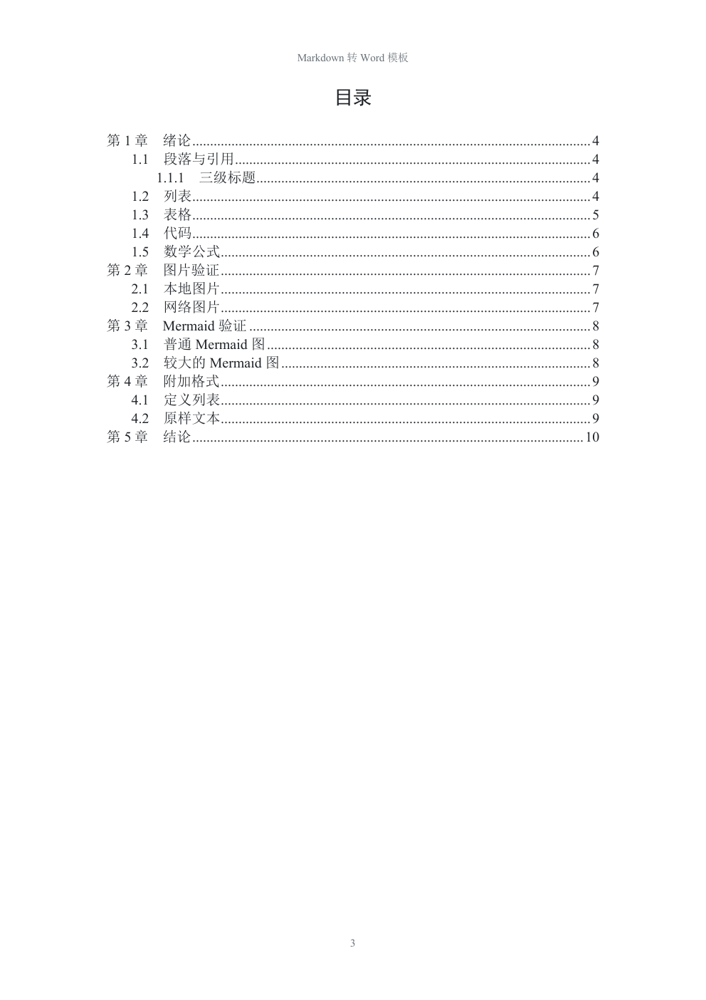
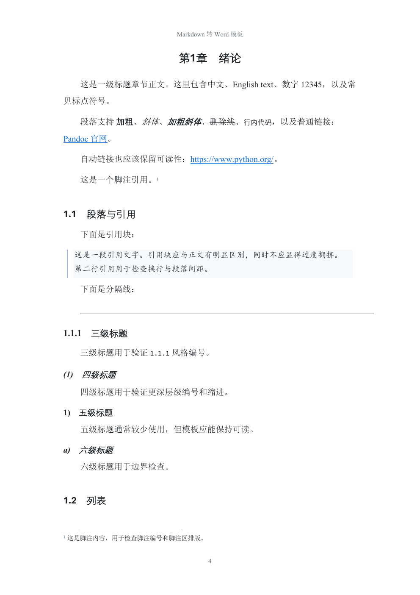
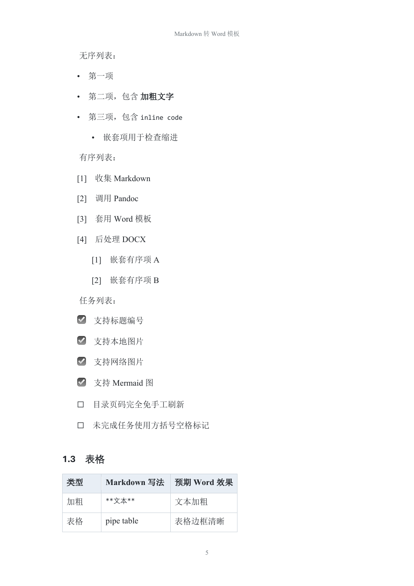
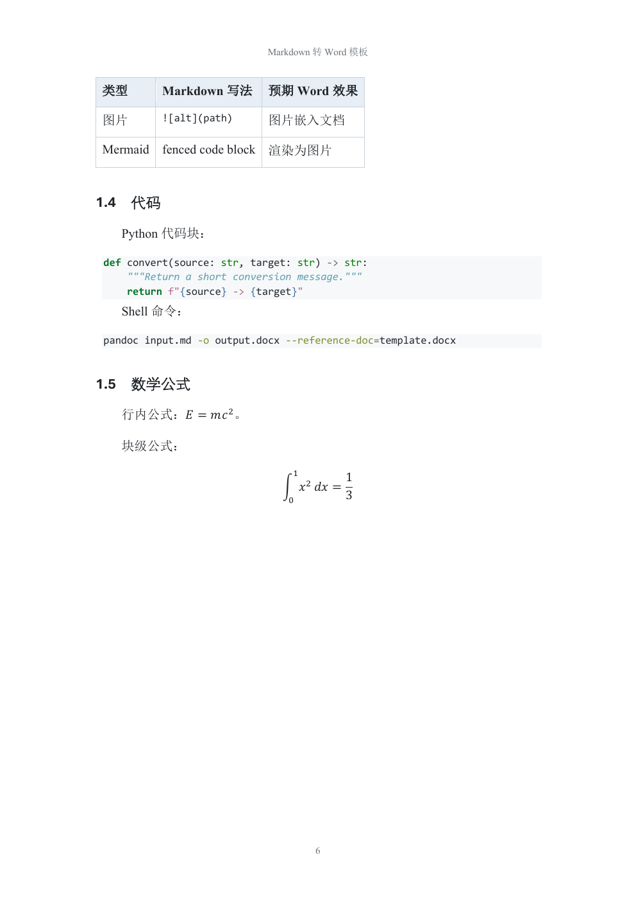
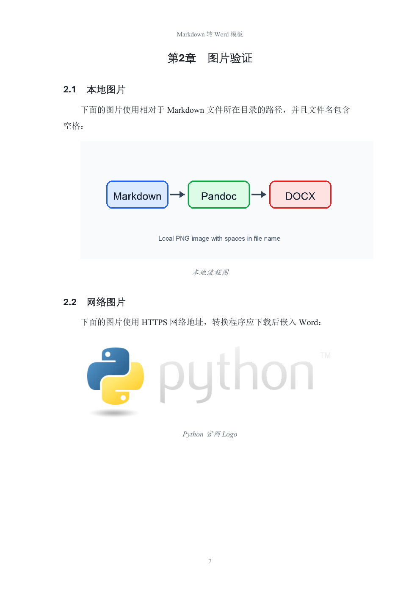
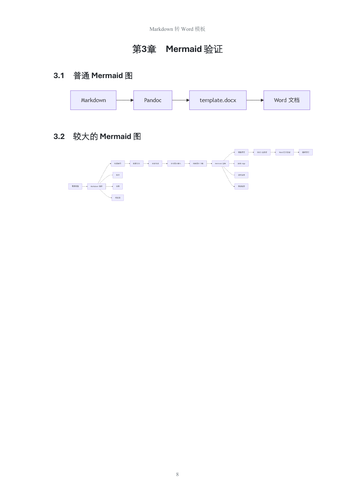
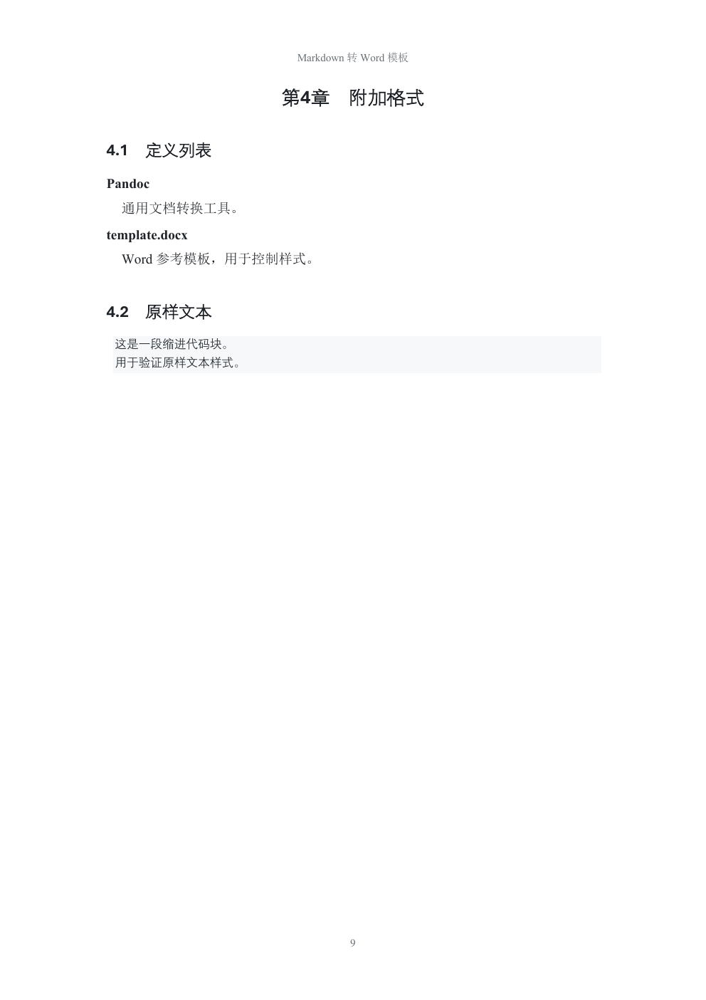
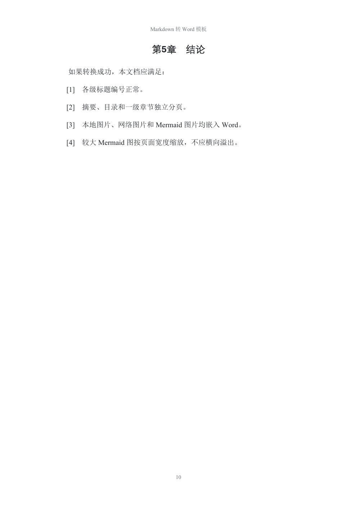

# markdown-to-word-kit

基于 Pandoc 的 Markdown 转 Word DOCX 工具包，支持自定义 Word 模板、目录、图片、Mermaid/PlantUML 图表、列表优化和页眉页脚迁移。

## 适用场景

- 把 Markdown 文档转换成排版规整的 Word `.docx`。
- 使用统一的 `template.docx` 控制正文、标题、目录、表格、代码块等样式。
- 在 Windows 上提供可解压即用的全量包。
- 在 macOS 上使用本机已有的 `python3` 和 `pandoc` 快速转换。
- 后续拿到公司标准 Word 后，只迁移页眉页脚，不破坏当前正文样式。

## 仓库结构

```text
markdown-to-word-kit/
  README.md
  examples/
    full-format.md
    full-format.docx
    full-format-preview.pdf
    assets/
      full-format-preview-page-01.png
      ...
  md2word-win/
    convert.bat
    README.md
    _md2word/
      md2docx.py
      postprocess_docx.py
      import-header-footer.py
      diagram-filter.lua
      install-tools.ps1
      template.docx
  md2word-mac/
    convert.sh
    README.md
    _md2word/
      md2docx.py
      postprocess_docx.py
      import-header-footer.py
      diagram-filter.lua
      template.docx
```

Git 仓库只保留必要脚本、模板和说明。发布压缩包、Windows 便携工具目录、验证输出和临时文件不进入 Git。

## 发布包

发布包建议放在 GitHub Releases 中，不提交到 Git 仓库。

| 文件 | 用途 | 是否内置工具 |
| --- | --- | --- |
| `markdown-to-word-kit-v0.1.0-windows-full.zip` | Windows 全量包，解压即用 | 是，包含 Python、Pandoc、Node.js、Mermaid CLI |
| `markdown-to-word-kit-v0.1.0-windows-minimal.zip` | Windows 最小包，需要先安装工具 | 否 |
| `markdown-to-word-kit-v0.1.0-macos-full.zip` | macOS 全量命名包，使用系统工具 | 否 |
| `markdown-to-word-kit-v0.1.0-macos-minimal.zip` | macOS 最小命名包，使用系统工具 | 否 |
| `SHA256SUMS.txt` | 发布包校验值 | 不适用 |

说明：当前 macOS 的 `full` 与 `minimal` 内容一致，因为 macOS 包不内置 Pandoc、Node.js 或 Mermaid CLI；保留两个名称是为了和 Windows 的发布命名保持一致。

本地打包产物位于：

```text
dist/
```

## 快速开始

Windows 推荐下载：

```text
markdown-to-word-kit-v0.1.0-windows-full.zip
```

解压后运行：

```bat
convert.bat input.md output.docx
```

macOS 推荐下载：

```text
markdown-to-word-kit-v0.1.0-macos-full.zip
```

解压后运行：

```bash
cd md2word-mac
./convert.sh input.md output.docx
```

## 转换效果预览

完整格式验证示例：

- [Markdown 源文件](examples/full-format.md)
- [转换后的 Word 文档](examples/full-format.docx)
- [效果展示 PDF](examples/full-format-preview.pdf)

该示例覆盖摘要、目录、标题编号、段落、强调、链接、脚注、引用、分隔线、无序列表、有序列表、任务列表、表格、代码块、数学公式、本地图片、网络图片、Mermaid 图、定义列表和原样文本。

<p>
  
  
</p>

<p>
  
  
</p>

<p>
  
  
</p>

<p>
  
  
</p>

<p>
  
  
</p>

## 图表支持

Markdown 中可以写 Mermaid 或 PlantUML 代码块。转换时使用：

```bash
--diagrams
```

如果希望有图表工具就渲染、没有工具就保留为代码块，使用：

```bash
--auto-diagrams
```

Windows 全量包已经内置 Mermaid CLI，并会优先复用系统 Edge 或 Chrome 作为浏览器内核。

## 图片路径

推荐使用相对于 Markdown 文件所在目录的路径：

```markdown


```

也支持 HTTPS 网络图片。转换程序会先尝试下载网络图片，再嵌入到 Word 中。

## 页眉页脚迁移

如果后续拿到公司标准 Word，可以只迁移页眉页脚，不直接覆盖整个 `template.docx`。这样可以保留当前已经调好的正文、标题、目录、列表和表格样式。

macOS 示例：

```bash
python3 md2word-mac/_md2word/import-header-footer.py company-template.docx md2word-mac/_md2word/template.docx -o template.company.docx
```

Windows 示例：

```bat
cd md2word-win\_md2word
tools\python\python.exe import-header-footer.py company-template.docx template.docx -o template.company.docx
```

确认 `template.company.docx` 的页眉页脚正确后，再替换正式模板。

## 开发说明

常用验证命令：

```bash
python3 -m py_compile md2word-mac/_md2word/*.py md2word-win/_md2word/*.py
```

仓库忽略以下内容：

- `dist/`
- `md2word-win/_md2word/tools/`
- `verification/`
- 临时 DOCX、Python 缓存和系统文件
