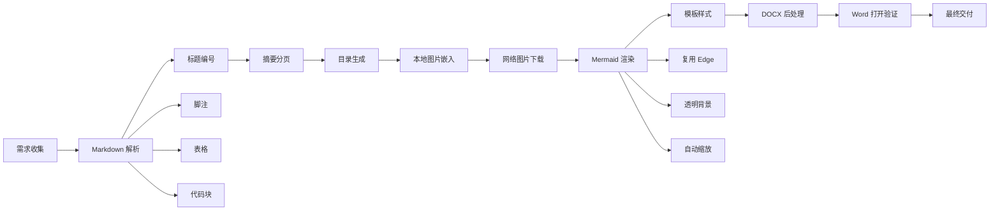

# 绪论

这是一级标题章节正文。这里包含中文、English text、数字 12345，以及常见标点符号。

段落支持 **加粗**、*斜体*、***加粗斜体***、~~删除线~~、`行内代码`，以及普通链接：[Pandoc 官网](https://pandoc.org)。

自动链接也应该保留可读性：<https://www.python.org/>。

这是一个脚注引用。[^intro-note]

[^intro-note]: 这是脚注内容，用于检查脚注编号和脚注区排版。

## 段落与引用

下面是引用块：

> 这是一段引用文字。引用块应与正文有明显区别，同时不应显得过度拥挤。
> 第二行引用用于检查换行与段落间距。

下面是分隔线：

---

### 三级标题

三级标题用于验证 `1.1.1` 风格编号。

#### 四级标题

四级标题用于验证更深层级编号和缩进。

##### 五级标题

五级标题通常较少使用，但模板应能保持可读。

###### 六级标题

六级标题用于边界检查。

## 列表

无序列表：

- 第一项
- 第二项，包含 **加粗文字**
- 第三项，包含 `inline code`
  - 嵌套项用于检查缩进

有序列表：

1. 收集 Markdown
2. 调用 Pandoc
3. 套用 Word 模板
4. 后处理 DOCX
   1. 嵌套有序项 A
   2. 嵌套有序项 B

任务列表：

- [x] 支持标题编号
- [x] 支持本地图片
- [x] 支持网络图片
- [x] 支持 Mermaid 图
- [ ] 目录页码完全免手工刷新
- [ ] 未完成任务使用方括号空格标记

## 表格

| 类型 | Markdown 写法 | 预期 Word 效果 |
| --- | --- | --- |
| 加粗 | `**文本**` | 文本加粗 |
| 表格 | pipe table | 表格边框清晰 |
| 图片 | `` | 图片嵌入文档 |
| Mermaid | fenced code block | 渲染为图片 |

## 代码

Python 代码块：

```python
def convert(source: str, target: str) -> str:
    """Return a short conversion message."""
    return f"{source} -> {target}"
```

Shell 命令：

```bash
pandoc input.md -o output.docx --reference-doc=template.docx
```

## 数学公式

行内公式：$E = mc^2$。

块级公式：

$$
\int_0^1 x^2 dx = \frac{1}{3}
$$

# 图片验证

## 本地图片

下面的图片使用相对于 Markdown 文件所在目录的路径，并且文件名包含空格：


## 网络图片

下面的图片使用 HTTPS 网络地址，转换程序应下载后嵌入 Word：


# Mermaid 验证

## 普通 Mermaid 图


## 较大的 Mermaid 图



# 附加格式

## 定义列表

Pandoc
: 通用文档转换工具。

template.docx
: Word 参考模板，用于控制样式。

## 原样文本

    这是一段缩进代码块。
    用于验证原样文本样式。

# 结论

如果转换成功，本文档应满足：

1. 各级标题编号正常。
2. 摘要、目录和一级章节独立分页。
3. 本地图片、网络图片和 Mermaid 图片均嵌入 Word。
4. 较大 Mermaid 图按页面宽度缩放，不应横向溢出。
