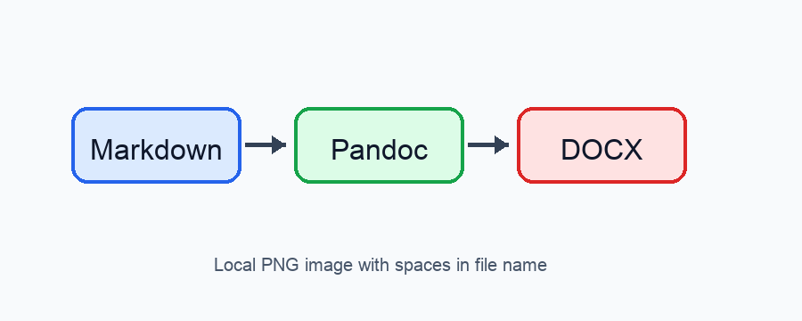

# Markdown 转 Word 示例

这是一份用于展示转换效果的简短 Markdown。它覆盖常见正文、标题、列表、任务列表、表格、代码块和图片。

## 列表效果

无序列表：

- 支持稳定的项目符号
- 支持中文正文中的明显间距
- 不依赖 Word 自动编号

有序列表：

1. 编写 Markdown
2. 执行转换命令
3. 生成 Word DOCX

任务列表：

- [x] 已完成的任务
- [ ] 未完成的任务

## 表格效果

| 类型 | Markdown 写法 | Word 效果 |
| --- | --- | --- |
| 标题 | `# 标题` | 自动编号 |
| 图片 | `` | 嵌入文档 |
| 任务 | `- [x] item` | 复选框样式 |

## 代码块

```python
def convert(source: str, target: str) -> str:
    return f"{source} -> {target}"
```

## 图片效果


