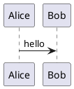

# markdown-to-word-kit for macOS

macOS 版本用于把 Markdown 转换为 Word `.docx`。它包含模板和转换脚本，但不内置 Pandoc、Node.js 或 Mermaid CLI。

## 选择发布包

| 发布包 | 说明 |
| --- | --- |
| `markdown-to-word-kit-v0.1.0-macos-full.zip` | macOS 全量命名包，包含模板和脚本 |
| `markdown-to-word-kit-v0.1.0-macos-minimal.zip` | macOS 最小命名包，当前内容与 full 一致 |

说明：macOS 包默认使用系统中已有的 `python3` 和 `pandoc`，所以当前 `full` 与 `minimal` 内容一致。保留两个名称是为了和 Windows 的发布命名保持一致。

## 依赖

必需：

```bash
python3 --version
pandoc --version
```

可选：

```bash
mmdc --version
plantuml -version
```

`mmdc` 用于渲染 Mermaid，`plantuml` 用于渲染 PlantUML。没有这些工具时，普通 Markdown 转 Word 仍然可用。

## 转换命令

进入目录：

```bash
cd path/to/md2word-mac
chmod +x convert.sh
```

最简单用法：

```bash
./convert.sh thesis.md
```

指定输出文件：

```bash
./convert.sh thesis.md thesis.docx
```

渲染 Mermaid / PlantUML：

```bash
./convert.sh thesis.md thesis.docx --diagrams
```

有图表工具就渲染，没有工具就跳过：

```bash
./convert.sh thesis.md thesis.docx --auto-diagrams
```

不生成目录：

```bash
./convert.sh thesis.md thesis.docx --no-toc
```

## Markdown 写法

标题：

```markdown
# 引言
## 研究背景
### 研究内容
```

输出中会自动加标题编号：

```text
第1章　引言
1.1　研究背景
1.1.1　研究内容
```

摘要建议写在 YAML 元数据中：

```markdown
---
title: "文档标题"
author: "作者"
date: "2026-06-28"
abstract: |
  这里写摘要内容。
---
```

列表会转换为稳定的文本前缀：

```text
•　无序列表
[1]　有序列表
☑　已完成任务
☐　未完成任务
```

## 图片路径

推荐使用相对于 Markdown 文件所在目录的路径：

```markdown


```

也支持 HTTPS 网络图片。转换程序会先尝试下载网络图片，再嵌入到 Word 中。

## 图表代码块

Mermaid：

````markdown

````

PlantUML：

````markdown

````

使用 `--auto-diagrams` 时，如果本机没有可用图表工具，转换程序会自动跳过图表渲染。

## 替换页眉页脚

拿到公司 Word 模板后，可以只迁移页眉页脚，不破坏当前模板样式：

```bash
python3 _md2word/import-header-footer.py company-template.docx _md2word/template.docx -o _md2word/template.company.docx
```

确认 `template.company.docx` 的页眉页脚正确后，再替换正式模板：

```bash
cp _md2word/template.company.docx _md2word/template.docx
```

## 常见问题

如果提示找不到 Pandoc：

```text
Pandoc not found
```

请先安装 Pandoc，并确认 `pandoc --version` 可运行。

如果 `--diagrams` 失败，请先确认 `mmdc` 或 `plantuml` 已安装；如果不确定是否安装，可以改用 `--auto-diagrams`。
