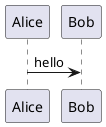

# markdown-to-word-kit for Windows

Windows 版本用于把 Markdown 转换为排版规整的 Word `.docx`。普通用户只需要使用根目录的 `convert.bat`。

## 选择发布包

| 发布包 | 适合谁 | 是否需要安装工具 |
| --- | --- | --- |
| `markdown-to-word-kit-v0.1.0-windows-full.zip` | 想解压即用的用户 | 不需要 |
| `markdown-to-word-kit-v0.1.0-windows-minimal.zip` | 想要小包体积，或公司环境已有工具的用户 | 通常需要 |

`windows-full` 已包含：

- Python
- Pandoc
- Node.js
- Mermaid CLI
- Mermaid 所需的 `node_modules`

`windows-minimal` 不包含 `_md2word/tools/`，需要按“安装工具”章节准备依赖。

## 目录结构

```text
md2word-win/
  convert.bat
  README.md
  _md2word/
    md2docx.py
    postprocess_docx.py
    import-header-footer.py
    diagram-filter.lua
    install-tools.ps1
    template.docx
    tools/
      python/
      pandoc/
      node/
      mermaid/
      plantuml/
```

不要单独移动 `convert.bat` 或 `_md2word`。两者需要保持在同一个 `md2word-win` 目录下。

## 安装工具

如果使用 `windows-full`，通常可以跳过本节。

如果使用 `windows-minimal`，在 PowerShell 中执行：

```powershell
cd path\to\md2word-win\_md2word
.\install-tools.ps1
```

安装 Mermaid 支持：

```powershell
.\install-tools.ps1 -WithMermaid
```

安装 PlantUML 支持：

```powershell
.\install-tools.ps1 -WithPlantUml
```

同时安装 Mermaid 和 PlantUML：

```powershell
.\install-tools.ps1 -WithDiagrams
```

Mermaid 渲染需要浏览器内核。转换程序会优先复用系统已安装的 Edge 或 Chrome；如果没有 Edge/Chrome，才需要额外准备 Chromium。

## 转换命令

最简单用法：

```bat
convert.bat thesis.md
```

指定输出文件：

```bat
convert.bat thesis.md thesis.docx
```

渲染 Mermaid / PlantUML：

```bat
convert.bat thesis.md thesis.docx --diagrams
```

有图表工具就渲染，没有工具就跳过：

```bat
convert.bat thesis.md thesis.docx --auto-diagrams
```

不生成目录：

```bat
convert.bat thesis.md thesis.docx --no-toc
```

## Markdown 写法

标题：

```markdown
# 引言
## 研究背景
### 研究内容
```

输出中会自动加标题编号，并在编号和文字之间使用全角空格：

```text
第1章　引言
1.1　研究背景
1.1.1　研究内容
```

摘要建议写在 YAML 元数据中：

```markdown
---
title: "文档标题"
author: "作者"
date: "2026-06-28"
abstract: |
  这里写摘要内容。
---
```

列表会转换为稳定的文本前缀，避免 Word/WPS 自动编号在不同环境中漂移：

```markdown
- 无序列表
1. 有序列表
- [x] 已完成任务
- [ ] 未完成任务
```

输出为：

```text
•　无序列表
[1]　有序列表
☑　已完成任务
☐　未完成任务
```

## 图片路径

推荐使用相对于 Markdown 文件所在目录的路径：

```markdown


```

也可以使用 HTTPS 网络图片：

```markdown

```

转换程序会先尝试下载网络图片，再交给 Pandoc 嵌入 Word。生成的 Word 文档保存的是图片内容，不依赖原始链接继续可用。

建议优先使用 `png` 或 `jpg/jpeg`，Word 兼容性最好。

## 图表代码块

Mermaid：

````markdown

````

PlantUML：

````markdown

````

使用 `--diagrams` 时，图表会渲染为图片并嵌入 Word。

## 替换页眉页脚

可以把公司 Word 文档里的页眉页脚迁移到当前模板，但不建议直接用公司 Word 覆盖 `_md2word/template.docx`。当前模板中还包含正文、标题、目录、表格、代码块等样式，直接覆盖可能破坏转换效果。

推荐先输出到新文件：

```bat
cd path\to\md2word-win\_md2word
tools\python\python.exe import-header-footer.py company-template.docx template.docx -o template.company.docx
```

确认 `template.company.docx` 的页眉页脚正确后，再替换正式模板：

```bat
copy /Y template.company.docx template.docx
```

脚本支持普通页眉页脚、首页不同页眉页脚、奇偶页不同页眉页脚，以及页眉页脚引用的图片等资源。

## 常见问题

如果提示找不到 Python：

```text
Python 3 not found
```

请使用 `windows-full` 包，或在 `_md2word` 目录运行：

```powershell
.\install-tools.ps1
```

如果 Mermaid 渲染失败，先确认 Edge 或 Chrome 已安装；再确认 Mermaid CLI 是否可用：

```bat
_md2word\tools\mermaid\mmdc.cmd --version
```

如果网络图片无法下载，确认转换机器可以访问该图片 URL，或改成本地图片路径。
